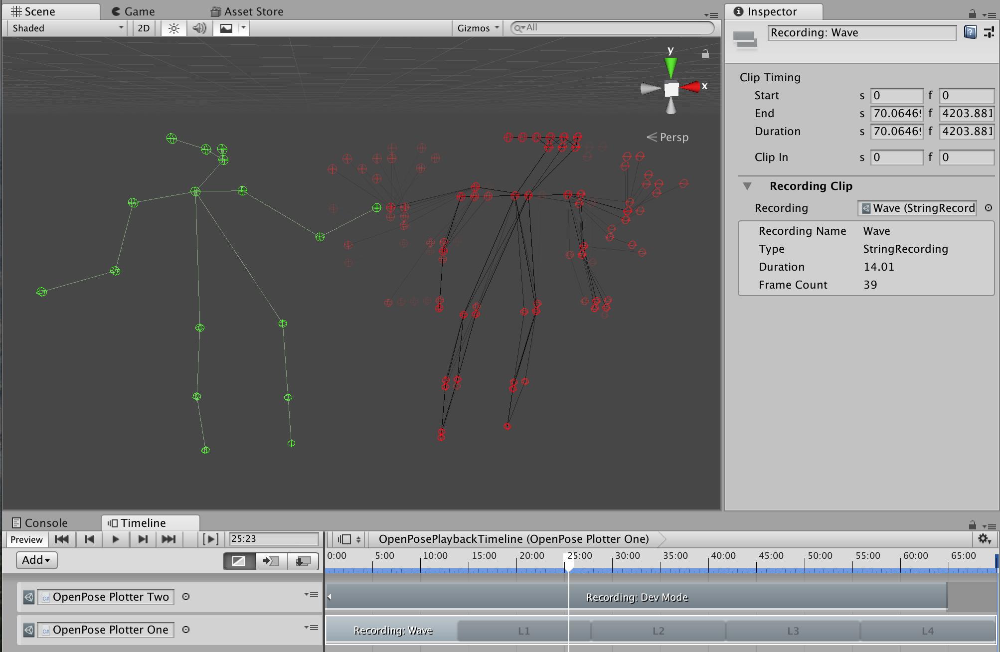
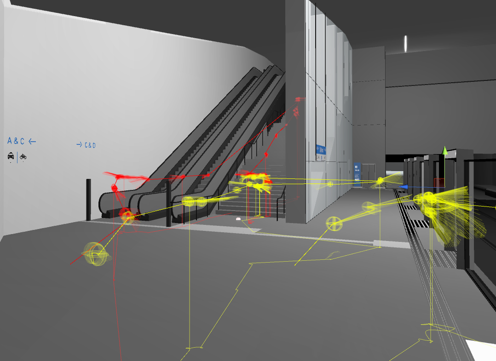
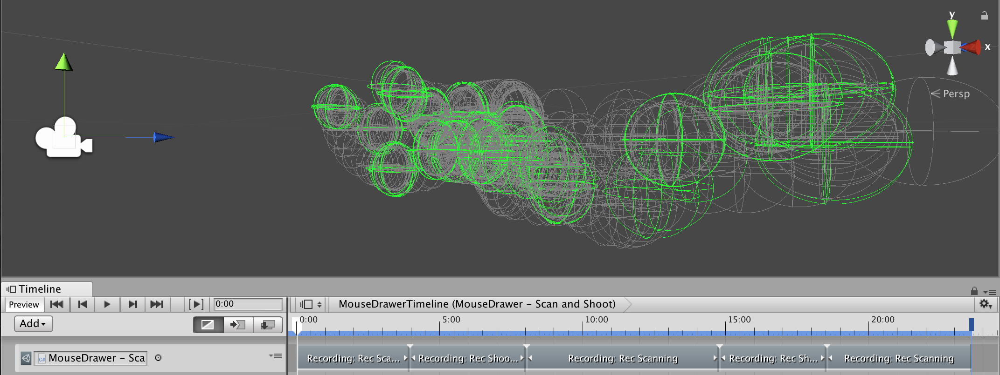
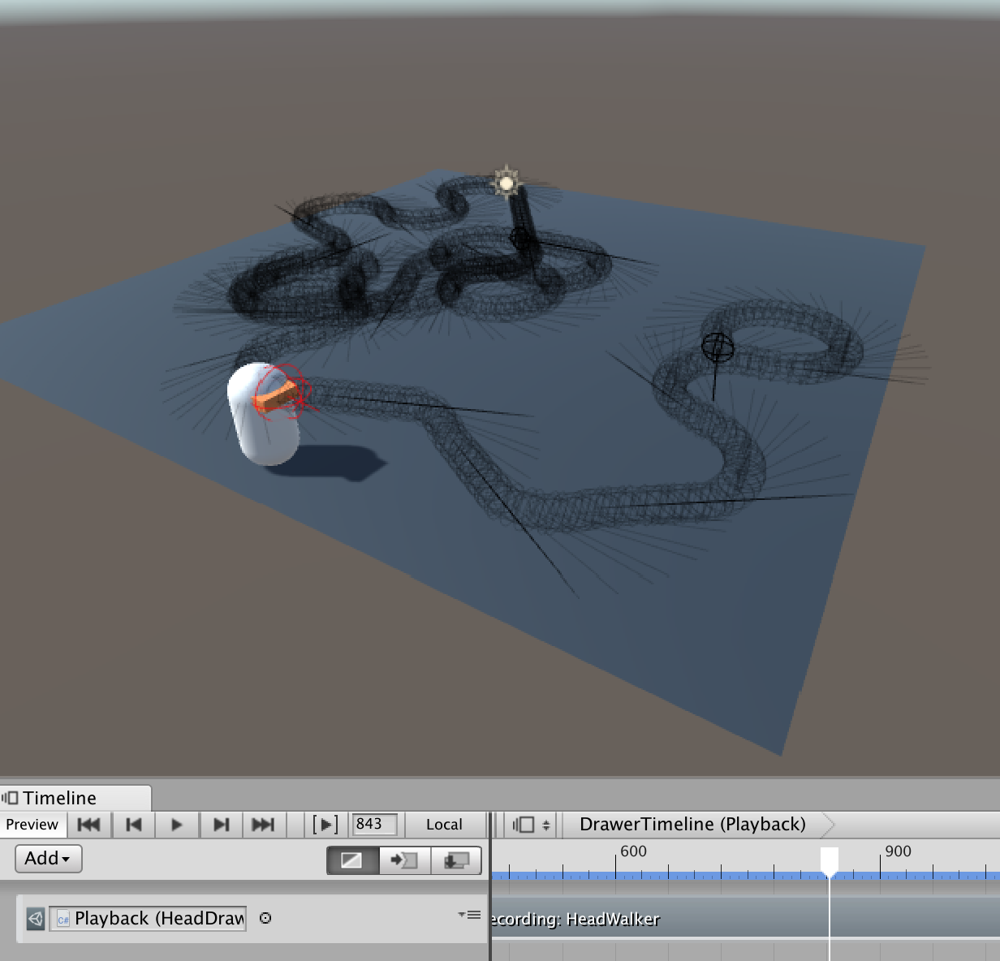
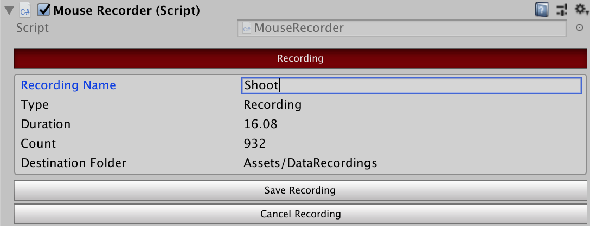
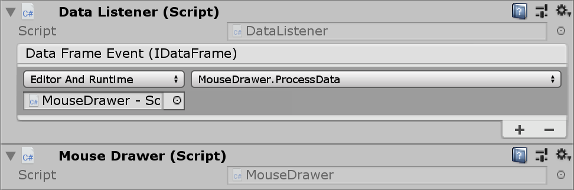

# RecordAndRepeat

RecordAndRepeat is a plugin for [Unity3d](https://unity3d.com/), which supports recording of custom data and playback via the Unity3d Timeline.

The core of the plugin are recordings stored as [ScriptableObjects](https://docs.unity3d.com/ScriptReference/ScriptableObject.html). You can plug them into custom scripts via the Inspector (to access and visialize the data) or play them back in a flexible matter due to an integration into the powerful Unity Timeline.

This allows for a variety of applications!

## Usecases

### Prototyping with recorded data

Using recorded rather than live data can drastically smoothen the development process of your prototypes. It was originally developed for recording external tracking information (OpenPose), but can handle any kind of serializable data - produced inside Unity or coming from external.

<p align="center">
  
</p>


### Spatial User Testing and Training

To track and visually layer user movements is another great usecase. In applications like spatial user tests or trainings conducted in AR/VR, it allows to compare, analyse and quantify user behaviours.

<p align="center">
  
</p>

## Getting started

* Download the latest unity-package under [releases](https://github.com/fx-lange/unity-record-and-repeat/releases). 
* Drag and drop the package into your Asset folder inside the Project Window.
* Checkout the [example folders](#Examples) with scenes showcasing recording, playback and plotting.

  (Be aware, that the example scenes won't work if you clone directly instead of using the release package.)

* Get an overview of the API in the [Usage](#Usage) section.

## Examples

*Be aware, that the example scenes won't work if you clone directly instead of using the release package and make sure to activate Gizmos in the Game window.*

### Mouse

Two scenes showcasing recording, plotting and playback of mouse data. The custom mouse class containing positions and button state is stored as a Json String.

Folder: [Example_MouseRecording](Example_MouseRecording)

<p align="center">
  
</p>

### Transform

In this example scene we are recording a simplified transform of the character's  head. Besides plotting the character's behaviour (via gizmos) the example also showcases replaying the recording.

Folder: [Example_TransformRecording](Example_TransformRecording)

<p align="center">
  
</p>

## Usage

`Recorder` and `DataListener` are the components needed in order to hook your own data objects into RecordAndRepeat. With that in place you can control recording and playback via RecordAndRepeat's Inspector interface and Unity Timeline features.

### Record

The `Recorder` component allows to define what kind of data objects you want to record and to control how you want to record them (for example every frame?). Use it as a component or feel free to extend it directly.

Below you find a compressed script from the [MouseRecorder](Example_MouseRecording/Scripts/MouseRecorder.cs) example, which utilizes the `Recorder` and passes serializable data objects to the `Recorder.RecordAsJson` function.

```csharp
using RecordAndRepeat;
public class MouseRecorder : MonoBehaviour
{
    [System.Serializable]
    public class MouseData //your custom data
    {
        public Vector3 worldPos;
        public bool pressed;
    }

    Recorder recorder;
    MouseData mouseData = new MouseData();

    void Awake()
    {
        recorder = GetComponent<Recorder>();
        recorder.DefaultRecordingName = "New Mouse Recording";
    }

    void Update()
    {
        if (recorder.IsRecording)
        {
            // Update mouseData...

            recorder.RecordAsJson(mouseData);
        }
    }
}
```

Controlling the recorder as well as defining the name of the recording is done via the Inspector interface or via code (`Recorder.StartRecording()`, `Recorder.SaveRecording()`, `...`).

<p align="center">
  
</p>

### Plot

If you want to visualize a whole recording for example, the getter `List<IDataFrame> Recording.DataFrames` allows to work directly with Recordings in custom scripts. In this case `DataListener` is not needed.

```csharp
foreach (DataFrame frame in recording.DataFrames)
{
    MouseData mouseData = frame.ParseFromJson<MouseData>();
    ...
}
```

*Snippet of [MousePlotter](Example_MouseRecording/Scripts/MousePlotter.cs) example.*

### Repeat

Recordings can be drag&dropped into RecordAndRepeat Timeline tracks and arranged via the Timeline interface. 

<p align="center">
  
</p>

In order to receive the data during playback you can utilize the `DataListener` component, which offers C# `events` and `UnityEvents`.
After adding `DataListener`  as a component you can use it as a _TrackBinding_ in corresponding tracks.

<p align="center">
  
</p>

*Screenshot of [MouseDrawer](Example_MouseRecording/Scripts/MouseDrawer.cs) example.*


-------------------

As an alternative to _events_, you can extend `DataListener` and override the `DataListener.ProcessData(IDataFrame)` method.

```csharp
using RecordAndRepeat;
public class MouseDrawer : DataListener

  //Initialize members...
  
  public override void ProcessData(IDataFrame frame)
  {
      DataFrame jsonFrame = frame as DataFrame;
      mouseData = jsonFrame.ParseFromJson<MouseData>();
  }
  
  ...
}
```

<!-- ### Settings (should both be part of the examples + comment )

* default name
* playmode only -->
